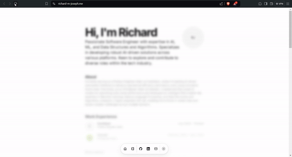

<div align="center">

</div>

# Richard's Portfolio

Welcome to my professional portfolio, built with Next.js and deployed on Azure. This site showcases my projects, skills, and contributions to the tech community.

## Features

- **Portfolio Showcase**: Displays my most significant projects and achievements.
- **Blog Section**: Features articles and tutorials I've written to share knowledge and insights.
- **Responsive Design**: Ensures a great experience on devices of all sizes, from phones to desktops.
- **Modern Technology Stack**: Utilizes the latest in web development frameworks and practices.

## Local Development

To run this portfolio locally, follow these steps:

1. **Clone the Repository**

   ```bash
   git clone https://github.com/yourgithubusername/portfolio.git
